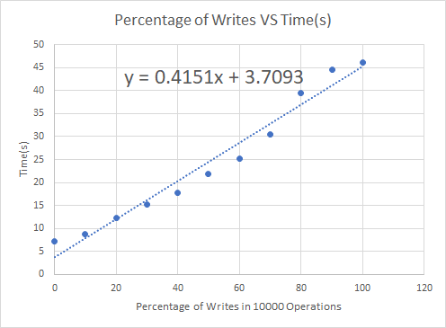

By:
- Ali Raza (razaal14)
- Jefferson Zhong (zhongjef)
- Shahmeer Shahid (shahid89)

## 0.1. Table of Contents
- [1. Overview](#1-overview)
- [2. Design philosophy](#2-design-philosophy)
- [3. Architecture](#3-architecture)
  - [3.1. Application](#31-application)
    - [3.1.1. Master Node](#311-master-node)
    - [3.1.2. Worker Node](#312-worker-node)
  - [3.2. Data](#32-data)
    - [3.2.1. Schema](#321-schema)
    - [3.2.2. Hash function](#322-hash-function)
- [4. Orchestration](#4-orchestration)
  - [4.1. Key Scripts/Files](#41-key-scriptsfiles)
  - [4.2. Cron Jobs](#42-cron-jobs)
- [5. Scalability](#5-scalability)
  - [5.1. Vertical scaling](#51-vertical-scaling)
  - [5.2. Horizontal scaling](#52-horizontal-scaling)
- [6. Consistency](#6-consistency)
- [7. Availability](#7-availability)
  - [7.1. Reads](#71-reads)
  - [7.2. Writes](#72-writes)
- [8. Disaster recovery](#8-disaster-recovery)
- [9. Performance Testing](#9-performance-testing)
  - [9.1. Process](#91-process)
  - [9.2. Random Reads](#92-random-reads)
  - [9.3. Effect of write operations](#93-effect-of-write-operations)
- [10. Evaluation](#10-evaluation)
  - [10.1. Strengths](#101-strengths)
  - [10.2. Weaknesses](#102-weaknesses)
  - [10.3. Other considerations](#103-other-considerations)


# 1. Overview

In creating this project, we aimed to create a system which was highly specialized for the specific task of shortening URL in a distributed manner.

# 2. Design philosophy
Our primary inspriation for the design of this system came from **Kubernetes**, which a system for automating the deployment and scaling of Docker containers on distributed systems.

The typical architecture implemented when using Kubernetes is shown below:

Source: https://www.researchgate.net/figure/Kubernetes-architecture_fig1_320248964

As shown, in Kuberenetes typically there is one Master node which manages and scales a set of Worker nodes. **Each worker node is stateless and runs the exact same tasks**. This greatly simplifies scaling the system, and the deployment of the system on a variety of nodes. Therefore, we decided that Kubernetes would be a good starting point for our system.

However, although we liked the Kubernetes architecture, we recognized some key changes that we would have to make to accomplish our goal. 

For example, Kubernetes systems often rely on a seperate database layer, which would be a database that is deployed externally from the cluster. However, as we wanted to make maximum use of the resources given to us, we decided that **we would not reserve any nodes for a distributed database** (ie Cassandra).

Furthermore, we also decided that the **Worker nodes should not have to know about each other**. This is because such an architecture would not scale well. For example, if we had a scenario where we had 10 nodes and each node would need to be able to interact with every other node, then this would create $10*10 = 100$ possible connections. If we had 20 nodes, then this would create $20*20 = 400$ possible connections between nodes. Therefore, the complexity of such a system would be $O(n^2)$, which is not desirable.

The above two conclusions (no nodes reserved for database and worker nodes should not interact with each other) combined meant that we would have tight coupling between the worker tasks and the assosciated data. Therefore, we decied that **we would not have a seperate database layer** (ie another distributed system that acts as a database), and instead we would assign data to each node according to a predefined schema.

Finally, we decied that **no worker node should be a single point of failuer**. Note: the master node is and will always be a single point of failure for any system that does not have a dynamic routing/dynamic DNS system, as is the case with us.

TODO, reads 100x likely than writes

Therefore, our key design philosophies were:

1. All worker nodes should run the same tasks.
2. No resources will be reserved for a database.
3. No seperate database layer.
4. Workers should not need to know about each other.
5. No worker node should be a single point of failure.


# 3. Architecture

## 3.1. Application

Our architectural diagram is shown below. We split the general set of tasks into two "nodes", the master node and worker nodes:

### 3.1.1. Master Node
The master node is responsible for proxying, caching, and load balancing requests across all worker nodes.

### 3.1.2. Worker Node
The worker node runs a Java URL Shortner process that reads and writes from a local (`/virtual/`) SQLite database.


When the proxy on the Master node receives a request, the request is first checked against the cache. If there is a cache miss, then we must proxy the incoming request to one of the worker nodes. To do this, we first select a "shard" that the incoming request belongs to (explained further in the next section) by hashing the short. 

Then, if the request is a read/`GET` request, the load balancer selects one of the nodes in the shard to send the request to (using round robin). If the request is a write/`PUT` request, then the load balancer forwards the request to all nodes in the shard.

## 3.2. Data 

### 3.2.1. Schema

The data is sharded and replicated across all worker nodes in the system. Our goal was to have a system where we maximize the scalability of the system (ie low replication factor), without having a single point of failure (ie replication factor `>=` 2). Naturally, we selected a replication factor of 2.

This means that if we have $n$ worker nodes, then the number of shards $S$ will be $n // 2$, and each shard will have minimum 2 and maximum 3 nodes. This means that every entry of data will be replicated across 2 or 3 nodes.

### 3.2.2. Hash function

To map each request to a shard, we use a **dynamic hash function**:

```python
def map_to_shard(short: str, num_shards: int):
    sum = 0
    for character in short:
        sum += ord(character) # sum up the ASCII value of each character in the short
    return sum % num_shards # return the shard number that this short currently maps to

```

This means that as we scale horizontally and add worker nodes, the hash/mapping of each data entry will change. This means that we will need to periodically redistribute data, which will be discussed in [Horizontal Scaling](#52-horizontal-scaling).

# 4. Orchestration
In addition to running the Proxy/Load Balancer, the Master Node is also responible for orchestrating Worker Nodes. To do this we have written a variety of scripts. Below are the key scripts/files:

## 4.1. Key Scripts/Files

- `proxy/hosts.txt`: The hostnames of the computers on which the worker nodes will exist. This file is considered a source of truth for the entire system and is used for nearly all tasks.
- `scripts/startOrchestration`: This script is to be ran **on the master node**. When this script is run, the Proxy/Load Balancer is started on the current system, and the URL Shortner process is created on each of the systems in `proxy/hosts.txt`. Finally, a variety of scripts are scheduled to run in intervals of 30 secconds using **crontab**. Each process that is created is configured to output all logs in `scripts/out/`
- `scripts/stopOrchestration`: Similarly to the above script, this script is configured to stop URL Shortner processes on worker nodes and to stop the Proxy / Load Balancer process on the current system. Then, the `crontab` is cleared, which deschedules the mentoned interval scripts.
- `scripts/startNode`: When ran, this script will start the URL Shortner process on the current system. When the process is started, it will check if `/virtual/$USER/URLShortner/urlshortner.db` exists, and will initialize it if it doesn't.
- `scripts/monitorUI.py`: this will start a UI that will ping the URL Shortner service on each host every second and display if the process is running.

## 4.2. Cron Jobs

In addition to the key scripts, we also have services that are configured to run on intervals.

- `scripts/healthService`: This script will check if each system is `proxy/hosts.txt` has a running URLShortner process, and outputs the results to `scripts/healthCheck.txt`.
- `scripts/fixNode`: This script reads from the `scripts/healthCheck.txt` file generated by `healthService`. If it sees that one or more nodes is down, it runs the `startNode` script on that node.
- `scripts/dbConsistency.py`: This script will compare the number of lines in the database of each node within a shard. If it finds that one node is missing entrie relative to other nodes in the same shard, it triggers an `scp` of the database from the good node to the bad node.


# 5. Scalability
## 5.1. Vertical scaling
Our system scales vertically quite easily. The primary way in which this is done is through the use of multithreading. In both our Proxy/Load Balancer and URL Shortner, we spin up a new thread for every incoming connection. Although conventionally we would limit the number of threads to the number of threads supported by the CPU, in our testing we found that we increase perforamce by starting a new thread for every incoming connection. This is because most of the work is IO bound rather than CPU bound, which means we benefit by idling threads that are waiting on IO operations (ie a network respons).


## 5.2. Horizontal scaling
Our system is also designed to scale horizontally by adding nodes.

We have written a script that allows you to do this:
```shell
scripts/addNode HOSTNAME
```
When this script is ran, we first check if we are increasing the number of shards by adding this node. For example, if we go from 2 nodes to 3, the number of shards will remain as 1. However, if we go from 3 nodes to 4, the number of shards will increase from 1 to 2.

**Case 1: Number of shards remains the same**

In this scenario, all we must do is 
1. Run `startNode` on the new system.
2. Add the new host to `proxy/hosts.txt`
3. Run `dbConsistency.py`
4. Restart the Proxy/Load Balance (which is almost instantaneous)

Therefore, this starts the URL Shortner process on the new node, copies a database from another node in the same shard, and restarts the Proxy/Load Balancer on the Master Node, which adds the new node with near 0 downtime.

**Case 2: Number of shards increases**


This scenario is more complicated as the mapping of all the data in the system will change. Therefore, we must also redistribute all the data, while still servicing requests as normal. This is how we do it:

1. Run `startNode` on the new system.
2. Choose a *representative node* from each shard in the current list of nodes. These nodes will 'represent' the current shards.
3. On **all** nodes (including new node), run an *alternative URL Shortner process*. This process will be used to redistribute data without disturbing the already running system.
4. On the Master Node, start an *alternative Proxy/Load Balancer*.
5. For each row of data in each representative node, send a `PUT` request to the alternative Proxy on the master node. The master node will distribute these requests to the alternative URL Shortners running on all nodes.
6. After all data has been redistributed, **replace the default database in each node with the alternative database**.
7. Kill the alternative system (`scripts/stopOrchestration -d`).
8. Add the new host to `proxy/hosts.txt`
9. Restart the Proxy/Load Balance (which is almost instantaneous)

This will redistribute data, recompute the shards, and add a new node to the system with near 0 downtime. Importantly, while the system is redistributing data, it is still able to service requests.

# 6. Consistency
As mentioned in [Cron Jobs](#cron-jobs), we use `scripts/dbConsistency.py` (which is scheduled to run every 30 seconds) to ensure data consistency within each shard. This means that in the worst case, nodes within a shard will be inconsistent for 30 seconds. However, in the average case, nodes will only be inconsistent for 15 seconds.

# 7. Availability

## 7.1. Reads

If a node goes down and we fail to proxy a read request to it, we will automatically try another node in the same shard. Therefore, as long no more than 1 node within the same shard goes down, we will ensure read availability.

## 7.2. Writes

If a node goes down, then we will fail to write to all nodes in the same shard. However, we will still write to all the nodes in the shard that are still available. Then, when the node is back up and `scripts/dbConsistency.py` runs, the databases will be made consistent across all nodes.

# 8. Disaster recovery

As mentioned in [Cron Jobs](#cron-jobs), we use a combination of `healthService` and `fixNode` (which run one after another in 30 second intervals) to find and fix nodes that have gone down.

# 9. Performance Testing
## 9.1. Process
## 9.2. Random Reads
The graph below shows the result of varying number of reads with random shorts to our system when it is running on 5 worker nodes:


As shown, the gradient of the line of best fit is $0.0007$ (which is the response time in seconds per request), which means that the system processed $1 / 0.0007 = 1428.57$ requests per seconds.

## 9.3. Effect of write operations
Next we wanted to investigate the effect of write requests on the system. Therefore, we varied the percentage of reads in 10,000 requests. Below are our results:


As we can see, as the proportion of write requests increases, the response time per request also increases. This is to be expected, as write operations are significantly more intensive than read operations in SQLite. However, based off of the assumption that reads are much more likely than writes, as established in [2. Design philosophy](#2-design-philosophy), we can see that the system will be highly performant in normal conditions.

# 10. Evaluation
## 10.1. Strengths
As
## 10.2. Weaknesses
## 10.3. Other considerations

